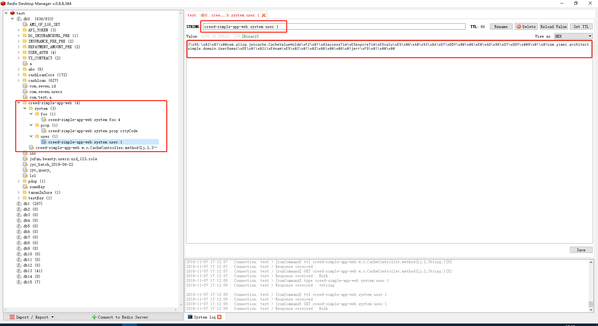
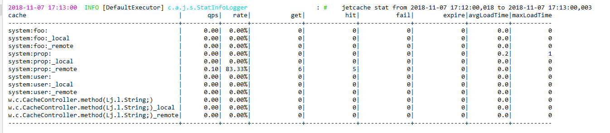

<p align="right"><b><em>last updated at {docsify-updated}</em></b></p>

## 一、缓存类型

分类|名称|用于|特点
---|---|---|---
自定义缓存|---|---|---
~|全局KV(HashMap)|自定义需要缓存使用的数据|一次加载、从不清空
~|自己开发的简易缓存工具|自定义简单情况下的缓存需求|灵活定义缓存的策略、依赖少
组件缓存|---|---|---
~|mybatis一级缓存|隔离一些数据库产生的幻读现象|大部分情况是很有用的特性、少部分情况需要考虑来分析问题
~|caffeine内存缓存|更灵活配置缓存、替代传统的orm多级缓存、分散中间件缓存的单点压力|侵入小、比较灵活、较好的中间缓存替代方案
中间件缓存|---|---|---
~|redis缓存|避免停机缓存清空、分布式多节点共享数据状态|停机缓存不丢失、多节点、多领域服务可以可信共享状态

## 二、缓存工具

```
spring cache: 很有用设计跟springframework支持,但是不够灵活,基本的二级缓存都没有实现的版本
jetcache: 立足于场景,有多种缓存实现版本,有基本的本地远程二级缓存支持,用法足够灵活,所以用该缓存工具能有比较好的适用性。
```

## 三、最终设计

```
orm使用mybatisplus,只使用mybatis的一级缓存
灵活缓存通过jetcache实现,使用本地远程二级缓存(远程为redis使用lettuce连接,本地为caffeine)
```

## 四、jetcache教程

```
1.创建缓存
@CreateCache 注解field创建缓存
@Cached 注解method创建缓存

2.更新缓存
@CacheUpdate 注解method,更新声名cache的缓存

3.删除缓存
@CacheInvalidate 注解method,删除声名cache的缓存

4.缓存刷新
@CacheRefresh 注解method,刷新声名cache的缓存,有分布式锁控制只有一台服务器刷新

5.多线程加载保护
@CachePenetrationProtect 注解method,对可能会同时加载访问的缓存进行上锁加载(暂时只支持jvm中)

6.高级功能(针对@CreateCache创建的缓存)
6.1 JSR107 style API
6.2 JetCache特有API
可以被jetcache 的 monitor 统计到 computeIfAbsent相当于putIfAbsent,还可以通过这个实现分布式的乐观锁,极端情况下有可能会出现两个节点同
时获得锁的情况,使用时要考虑到并发程度与失败后果
6.3 大写API
返回结果可以分析更详细的状态 SUCCESS, PART_SUCCESS, FAIL, NOT_EXISTS, EXISTS, EXPIRED

7.配置优先级
在spring的Environment中的全局配置与spring的配置优先级相同,注解中的配置会覆盖全局配置,使用API时会覆盖注解上的配置

8.版本bug
最新版2.5.9中目前出现了两个问题:
一是多层缓存无法cacheNullValue,已提issue,作者已经修复,会在2.5.10版本解决。
二是SPEL表达式使用的模式为即时编译,会在使用几次以后完全用编译过的表达式,但是与spring-boot-devtools冲突,该问题只在开发出现,建议把devtools删除
```

注:可以参见[creed/samples/springboot-multi]()项目中的使用方法

[详见jetcache github wiki](https://github.com/alibaba/jetcache/wiki/Home_CN)

[jetcache API 高级用法](https://github.com/alibaba/jetcache/wiki/CacheAPI_CN)

## 五、示例

### 1.配置加载

```java
@Service
public class GlobalConfigPropServiceImpl implements GlobalConfigPropService {
    @Override
    @Cached(cacheType = CacheType.BOTH,
            cacheNullValue = true,
            name = SceneConstant.CACHE_PREFIX + SceneConstant.CACHE_PROP,
            key = "#key"
    )
    @CacheRefresh(refresh = SceneConstant.CACHE_REFRESH_SEC)
    @CachePenetrationProtect
    public Map<String, String> getConfig(String key) {
        return loadProp().get(key);
    }

    private Map<String, Map<String, String>> loadProp() {
        Map<String, Map<String, String>> prop = new HashMap(SceneConstant.FOO_INT);
        Map<String, String> cityCodeConfig = new HashMap(SceneConstant.FOO_INT);

        cityCodeConfig.put("1", "北京");
        cityCodeConfig.put("2", "上海");
        cityCodeConfig.put("3", "广州");
        cityCodeConfig.put("4", "深圳");
        prop.put("cityCode", cityCodeConfig);
        return prop;
    }
}
```

### 2.需要缓存交互时状态即时更新

```java
@Service
@Slf4j
public class CacheServiceImpl implements CacheService {
    private static Map<Long, UserDomain> cache = new HashMap();

    @Override
    @Cached(cacheType = CacheType.BOTH,
            cacheNullValue = true,
            name = SceneConstant.CACHE_PREFIX + SceneConstant.CACHE_USER,
            key = "#id"
    )
    public UserDomain select(long id) {
        log.debug("查询");
        UserDomain user = cache.get(id);
        return user;
    }

    @Override
    @CacheUpdate(name = SceneConstant.CACHE_PREFIX + SceneConstant.CACHE_USER,
            key = "#user.id",
            value = "#result"
    )
    public UserDomain insertOrUpdate(UserDomain user) {
        log.debug("修改");
        cache.put(user.getId(), user);
        return user;
    }

    @Override
    @CacheInvalidate(name = SceneConstant.CACHE_PREFIX + SceneConstant.CACHE_USER,
            key = "#id"
    )
    public UserDomain delete(long id) {
        log.debug("删除");
        cache.remove(id);
        return cache.get(id);
    }
}
```

### 3.通用缓存方法

```java
@RestController
@RequestMapping("/cache")
@Slf4j
public class CacheController {
    @Autowired
    private CacheService cacheService;
    @Autowired
    private GlobalConfigPropService globalConfigPropService;
    /** 缓存变量 */
    @CreateCache(cacheType = CacheType.BOTH, name = SceneConstant.CACHE_PREFIX + "fieldCache")
    private Cache<Integer, String> feildCache;

    /**
     * <p>description : 给变量加缓存(key受类名、变量名、查询key值影响)</p>
     * <p>create   on : 2018-11-05 20:00:31</p>
     *
     * @author jerryniu
     * @version 1.0.0
     */
    @GetMapping("/feild")
    public String feild(int id) {
        log.debug("field --> 进入方法");
        feildCache.GET(1);
        return feildCache.computeIfAbsent(id, (key) -> {
            log.debug("field --> 查询数据库");
            return "foo" + (key + 1);
        }, true);
    }

    /**
     * <p>description : 对方法加缓存(key受类名、方法名、方法参数影响)</p>
     * <p>create   on : 2018-11-05 20:00:31</p>
     *
     * @author jerryniu
     * @version 1.0.0
     */
    @Cached(cacheType = CacheType.BOTH, key = "'[' + #id.toString() + ']'")
    @GetMapping("/method")
    public String method(String id) {
        log.debug("method --> 进入方法");
        log.debug("method --> 查询数据库");
        return id;
    }

    /**
     * <p>description : 分布式锁</p>
     * <p>create   on : 2018-11-05 20:00:31</p>
     *
     * @author jerryniu
     * @version 1.0.0
     */
    @GetMapping("/lock")
    public String lock() {
        log.debug("lock --> 进入方法");
        boolean hasRun = feildCache.tryLockAndRun(-1, SceneConstant.CACHE_LOCK_SEC, TimeUnit.SECONDS, () -> {
            log.debug("lock --> 获取锁");
            log.debug("lock --> 执行操作");
            log.debug("lock --> 释放锁");
        });
        return "" + hasRun;
    }
}
```

## 六、使用规范

```
1.必须指定缓存时间
缓存就是缓存,生产环境经常会出现网络异常、负载异常、中间件本身的问题、还有一些开发中出现的bug,极端情况下会造成服务中断,最终依赖的就是缓存
过期清理,要指出的是,缓存并不是到时间马上清空的,是通过标记过期时间来判断其是否有效,公司历史上有些永久的缓存无法清理,最后是通过redis后台命
令进行模糊批处理去清理的,但是有一些key值有二进制binary的很难通过命令去清除,这部分还是很多的。服务不能中断,这些习惯给我们维护redis与redis
扩容都带来了问题。缓存时间一般在30s到100s之间，视业务而定，要关注自己的内存消耗与key的增加删除逻辑，redis内存并不是无限的，长期处理多应
用的状态，一旦出现问题，所有系统都会受到影响。

2.key一定是文本!!!参见上一条,连接符为英文冒号:方便redisdesktopmanager进行管理

3.指定prefix,name,key值必须符合${prefix}:${name}的格式
在用脚手架工具生成代码以后,会在配置文件中自动用artifactId做prefix,自动清除根package的目录,缩写类名以前的包名为单个字母,方法参数与输入
参数都作为key的部分
eg:   com.yimei.architect.simple.web.controller.CacheController.method  -->   creed-simple-app-web:w.c.CacheController.method(Lj.l.String;)[5]
指定key值时,应声名在system中并领域属性,pattern为 ${prefix}:system:${domain}:${id}
eg:   creed-simple-app-web:system:user:1

与数据库的对应关系类似与
database      prefix
table         system:${domain}
primarykey    id

4.缓存null值(繁重的查询)
在一些场景下查询是非常重的,比如我们查询biz_repayment_plan表或者相关内容的时候,null值也是通过很重的计算才得到的,这个时要在注解中声名
cacheNullValue = true,特别说明的是目前jetcache 2.5.9 的多层缓存这个是不生效的,遇到这种场景请切换cacheType = CacheType.REMOTE,在
升级jetcache 2.5.10版本以后再改回来
redis缓存使用于大部分情况,二层缓存适用于需要更快响应速度的情况，但是节点数量变多的时候,只适用于配置的加载

5.限制本地内存消耗
有本地缓存的情况会加剧本地内存的消耗,要合理规划,部分情况需要限制一下,全局配置每个cache默认限制100条

6.缓存这档子事还是挺绕的,要多测试几次确保顺序没有问题,使用的时候要确定不要滥用,要关注命中率,主要是为了缓解数据库的压力,加快响应速度

```

> RedisDesktopManager截图:



> 后台日志截图:



> redis维护命令:

```
# key 删除脚本
redis-cli -h 127.0.0.1 -p 6379 -a password keys "prefix*" | xargs redis-cli -h 127.0.0.1 -p 6379 -a passwprd del

# key 转移db脚本 量少于1w时,阻塞
redis-cli -h 127.0.0.1 -p 6379 -a password -n 0 keys "prefix*" | xargs -I '{}' redis-cli -h 127.0.0.1 -p 6379 -a passwprd -n 0 move '{}' 1

# key 转移db脚本 量大有实时访问要求时,游标处理
redis-cli -h 127.0.0.1 -p 6379 -a password -n 0 --scan --pattern "prefix*" | xargs -I '{}' redis-cli -h 127.0.0.1 -p 6379 -a passwprd -n 0 move '{}' 1

# 清除db
redis-cli #连接redis
select 0 #选取db
flushdb #清除db中的所有数据

# 跨越redis服务器使用migrate命令(不常用)
```