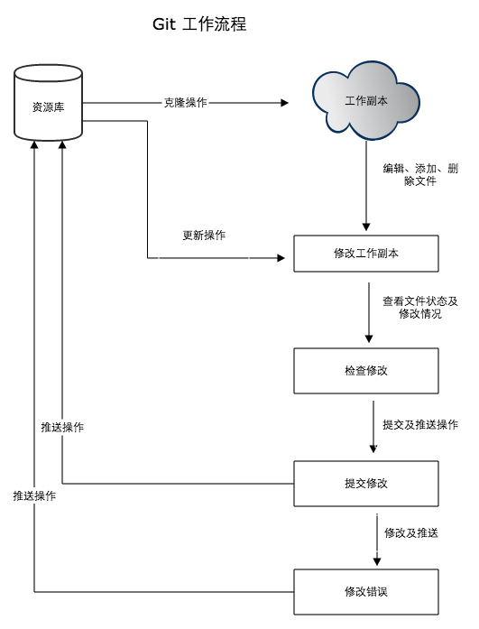
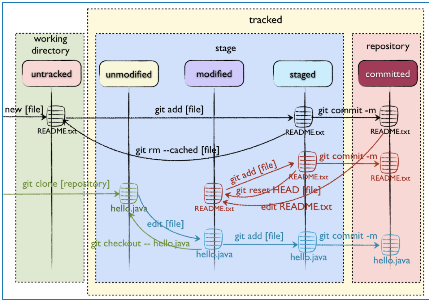
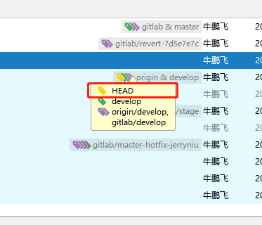
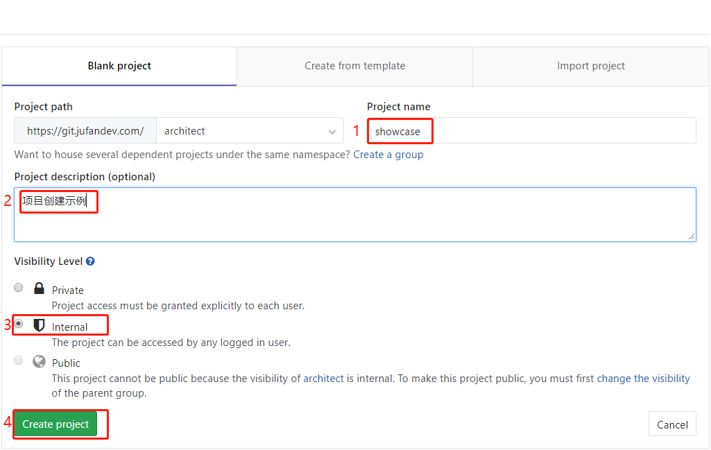
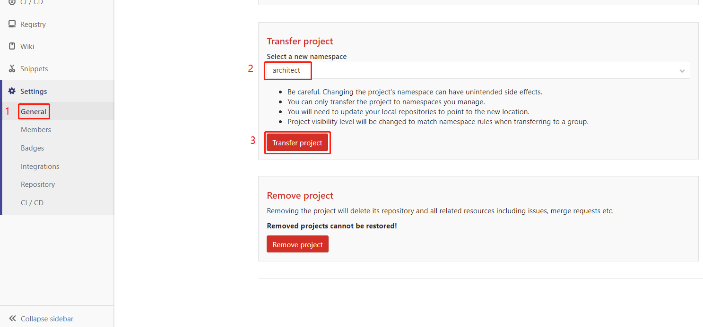
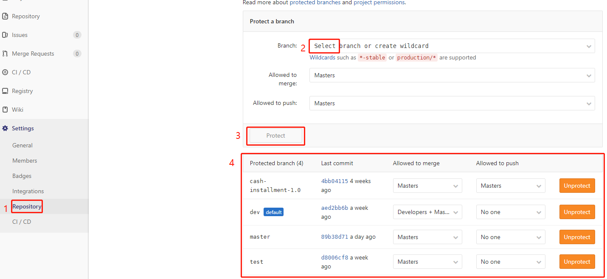

<p align="right"><b><em>last updated at {docsify-updated}</em></b></p>

### 一、git
* 概念
    * 远程仓库
    * 暂存区
    * 工作区
* 命令
    * init -创建仓库
    * clone -拷贝仓库
    * add -新添加文件到暂存区
    * commit -提交修改到暂存区
    * reset HEAD -回退暂存区未提交到远程仓库的修改(讲HEAD标记后面暂存的提交都取消,代码不发生改变)
    * log -提交历史
    * branch -添加分支,列出分支
        * branch --set-upstream -关联远程分支与本地分支
    * checkout -切换分支(检出)
    * merge -合并分支(把一个分支与当前分支合并,必须版本没有冲突(同一文件的版本链与时间戳都一致),仓库管理页面上合并就是用这种方式)
    * remote add -添加远程仓库(可以)
    * remote -显示远程仓库
    * fetch -从远程仓库下载新分支与数据,只更版本数据,不合并代码
    * pull -远程仓库的代码合并到本地仓库(相当于fetch+merge)
    * push -代码暂存区已经commit的代码推送到远程仓库
    * rebase -把代码与当前分支合并，没有恼人的merge信息，多人协作的时候要用fetch+rebase取代pull,避免产生过多的无用merge信息
    * stash -切换分支前记录已开发的内容,不commit到暂存区,开发完切回分支再把记录应用到本分支
* 切换远程分支
    * remote add -> checkout -> push (一般情况)
    * remote add  -> git push remote源 本地分支 (会推送到指定的远程仓库,默认关联远程仓库也会发生改变)
    * remote add  -> branch --set-upstream (命名不同会破坏一般约定,操作最合理的办法)



参考阅读：

[git 文件状态与工作区域](https://www.cnblogs.com/polk6/p/git-fileStatus.html)

Git的三个工作区域，文件的状态示意



reset head示意




### 二、gitlab管理

#### 2.1 权限

* 访问权限

```
    Private -私有,成员可见
    Internal -内部,登录人员可见
    Public -公开,任何人可见
```

* 行为权限

```   
    Owner -拥有者,项目负责人
    Master -管理者,组长,维护合并回退分支
    Developer -开发者
    Reporter -报告者
    Guest -访客
```

行为|Guest|Reporter|Developer|Master|Owner
---|---|---|---|---|---
***组权限***|||||
浏览组|✓|✓|✓|✓|✓
编辑组| | | | |✓
创建项目| | | | ✓|✓
管理组成员| | | | |✓
移除组| | | | |✓
***工程权限***|||||
创建issue|✓|✓|✓|✓|✓
留言评论|✓|✓|✓|✓|✓
更新代码| |✓|✓|✓|✓
下载工程| |✓|✓|✓|✓
创建代码片段| |✓|✓|✓|✓
创建合并请求| | |✓|✓|✓
创建新分支| | |✓|✓|✓
提交代码到非保护分支| | |✓|✓|✓
强制提交到非保护分支| | |✓|✓|✓
移除非保护分支| | |✓|✓|✓
添加tag| | |✓|✓|✓
创建wiki| | |✓|✓|✓
管理issue处理者| | |✓|✓|✓
管理labels| | |✓|✓|✓
创建里程碑| | | |✓|✓
添加项目成员| | | |✓|✓
提交保护分支| | | |✓|✓
使能分支保护| | | |✓|✓
修改/移除tag| | | |✓|✓
编辑工程| | | |✓|✓
添加deploy keys| | | |✓|✓
配置hooks| | | |✓|✓
切换visibility level| | | | |✓
切换工程namespace| | | | |✓
移除工程| | | | |✓
强制提交保护分支| | | | |✓
移除保护分支| | | | |✓

* 公司内部规范

```
    项目创建为Internal,确保所有成员都是可以看见代码的,不对测试人员、外组成员另设guest权限,也可以对有提高代码水平的童鞋一个学习成长的平台
    Owner为项目负责人
    Master为组管理员,负责管理维护分支、发布等等一切事宜
    Developer为组员,普通开发人员,代码提交者
```

#### 2.2 项目管理

* 创建项目

```
    选择自己对应组->New Project->填写项目名、描述,选择权限为Internal->Create project
    Projects->Your Projects->New Project->填写项目名、描述,选择权限为Internal->Create project
```


* 转移项目

```
    项目页面->左侧Settings->General->Advanced settings->Transfer project->选择namespace->Transfer project
```


* 保护分支

```
    为防止误操作,规范分支管理权限,需要对分支、tag进行保护
    项目页面->Settings->Reporsitory->Protected Branches
    项目页面->Settings->Reporsitory->Protected Tags
    
    注：保护tag命名需要符合v*或*-release
    
    管理权限有merge跟push两种
    稳定分支需要限定push:no one&merge:masters
    开发分支需要限定push:masters+developers&merge:masters+developers
```


* 回退分支

```
    项目页面->Repository->Commits->选中要撤销的commit->右侧Options->选择并入分支->Revert->删除对应的Revert分支
```

* 关于CICD

```
    为加快集成效率,目标为依托gitlab与docker、k8s实现快速的构建测试反馈回路,单人管理几十几百个节点的管理发布
    gitlab支持添加.gitlab-ci.yml构建脚本,分布式提供基于一系列环境的构建脚本编写,目前在hippo团队有对shell runner的实践,后续推荐用docker runner
    
    具体runner配置在 项目页面->Settings->CI/CD->Runner Settings
```

[官方gitlab-ci-yml脚本示例工程](https://gitlab.com/gitlab-org/gitlab-ci-yml)

* 工作流

```
    基本需要3个分支：
    master -主要稳定分支(生产版本)
    stage -主要集成分支(测试版本)
    develop -所有代码集中分支(开发版本,确保代码最全)
    
    特殊分支(维护时需要,用完删除,不是必须有)：
    feature-branches -特性开发分支(feature-英文描述,如feature-autocheck)
    release-branches -长期维护分支(release-版本号,如release-1.1.x)
    hotfix-branches -修复分支(修复分支-hotfix-修复人员名,如master-hotfix-jerryniu)
    
    tag对应已发布
    branch对应开发过程中,停止开发后要创建tag,删除branch
    
    公司内部:
    项目一开始需要：
    额外创建stage分支、develop分支
    保护master分支权限为push:no one&merge:masters
    保护stage分支权限为push:no one&merge:masters
    保护develop分支权限为push:masters+developers&merge:masters+developers
    创建feature分支(大型工程组员多可选,这种情况需要把develop分支也保护push:no one&merge:masters)
    
    代码merge方向为feature branches -> develop -> stage -> master
    
    修复bug:
    1.从需要修复的分支创建hotfix分支
    2.bug修复
    3.从develop分支往上合并,合并到master分支
    如:
    线上出bug
    -> 从master拉取分支创建分支master-hotfix-jerryniu
    -> 修复bug
    -> 向develop合并成功,向stage分支合并成功,向master分支合并成功
    -> 从master拉取代码进行发布
    如果生产分支与stage分支develop分支是兼容或者代码一致的,也可以直接当作开发处理,提交develop向上合并stage、master
    
    生产环境发布成功以后,要对master该版本打tag,格式为 publish-yyMMdd发布序号
```

[git merge rebase reset revert cherry-pick 详细区别](https://www.cnblogs.com/ludashi/p/8213550.html)

* 管理原则

```
    1.保证master、stage分支稳定
    2.保证每次重要发布都有tag
    3.保证hotfix分支修复完删除
    4.重要发布版本需要把对应branches与tags保护起来
```