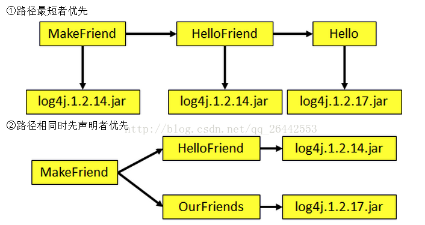
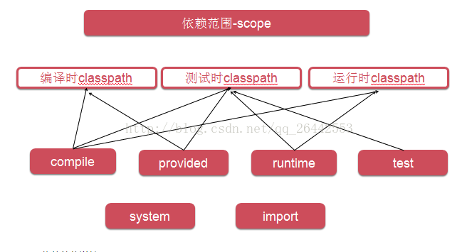
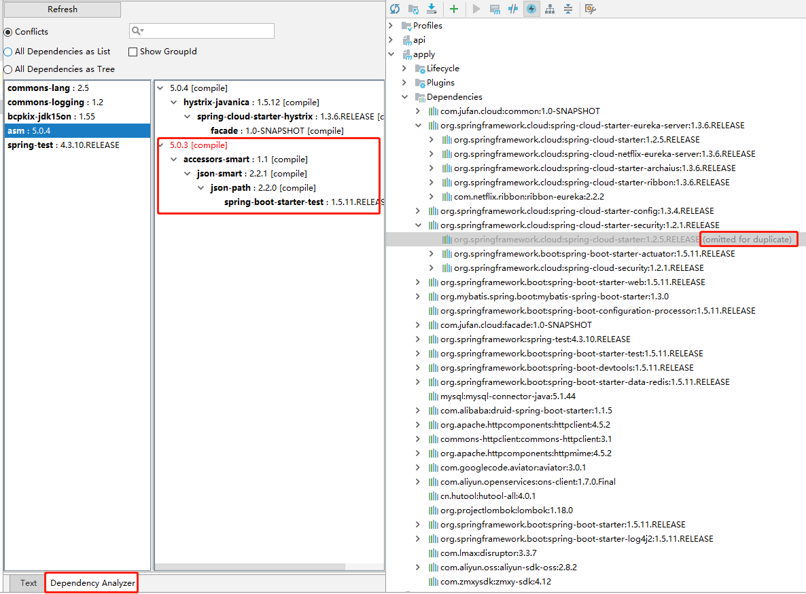

<p align="right"><b><em>last updated at {docsify-updated}</em></b></p>

## 一、基本概念

* Dependency mediation(依赖调解)
    * 最短路径优先
    * 路径长度一致,出现优先
    


* Dependency scope(依赖范围)
    * scope可继承

scope|brief|life|description
---|---|---|---
compile|默认|对主代码有效,对测试代码有效,打包运行时有效|编译、打包、参与运行、传递依赖
test|测试时有效|对主代码无效,对测试代码有效,被打包运行时无效|测试编译、测试运行、不打包、不传递依赖
runtime|运行时有效|对主代码无效,对测试代码无效,被打包运行时有效|不编译、参与运行、打包、传递依赖
import|版本管理|只在dependencyManagement中使用|传递依赖
provided|运行时提供|对主代码有效,对测试代码有效,被打包运行时无效|参与编译、不打包、参与运行、不传递依赖
system|系统提供|不经常使用|需要提供systemPath属性、不到仓库拉取、从本地系统指定路径下寻找



* Dependency management(依赖管理)
    * dependencyManagement(依赖传递)
        * GA相同
    * pluginManagement(插件依赖传递)
        * 有plugin声名,GA相同,inherited为true(默认)
* Excluded dependencies(排除依赖)
    * dependencies -> dependency -> exclusions -> exclusion
* Optional dependencies(可选依赖)
    * dependencies -> dependency -> optional (true则依赖不会传递,需要显式声名,false则会传递)
    * 与provided的区别:provided的包在运行时应该提供,默认需要提供才会正常运行,optional的意思是不用该部分的功能就可以不提供。[quote:maven官方的解释](http://maven.apache.org/guides/introduction/introduction-to-optional-and-excludes-dependencies.html)
    
* 特殊情况:dependencyManagement与依赖传递同时存在不产生冲突却产生错误的情况,依赖调解会范围包括dependencyManagement中的元素,dependencyManagement中的依赖优先,虽然不产生冲突,但是版本发生了变化,会导致异常
    * 要在dependencyManagement中显示声名该包的版本,两个版本2选1,选择高版本不冲突的,如果做不到,就在子模块中显示声名该包,缩短声名路径

## 二、最佳实践
* dependencies(依赖继承) -管理项目的所有版本依赖
* bom(依赖继承) -列出本项目的所有可选组件
* parent(构建继承) -管理项目的构建
* build(聚合) -管理需要构建的模块
* flatten-maven-plugin(精简pom) -清理pom文件敏感与无用属性

> 依赖冲突示意



> idea有关功能

```
右键pom.xml -> Maven -> Show Effective Pom -effective pom展示
安装插件Maven Helper -调试maven依赖冲突
```