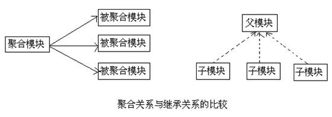

<p align="right"><b><em>last updated at {docsify-updated}</em></b></p>

## 一、可继承的元素
* groupId：项目组ID，项目坐标的核心元素
* version：项目版本，项目坐标的核心因素
* description：项目的描述信息
* organization：项目的组织信息
* inceptionYear：项目的创始年份
* url：项目的URL地址
* developers：项目的开发者信息
* contributors：项目的贡献者信息
* distributionManagement：项目的部署配置
* issueManagement：项目的缺陷跟踪系统信息
* ciManagement：项目的持续集成系统信息
* scm：项目的版本控制系统信息
* malilingLists：项目的邮件列表信息
* properties：自定义的Maven属性
* dependencies：项目的依赖配置
* dependencyManagement：项目的依赖管理配置
* repositories：项目的仓库配置
* build：包括项目的源码目录配置、输出目录配置、插件配置、插件管理配置等
* reporting：包括项目的报告输出目录配置、报告插件配置等

## 二、依赖管理

```
    dependencies依赖的模块是可继承的,但是子模块丧失了选择的权利,pom描述依赖并没有依赖到的包,还会加大依赖冲突的几率
    dependencyManagement可以约束dependencies,当groupId、artifactId一致的情况下,会加载父模块的配置
```

## 三、插件管理

```
    pluginManagement管理plugin,当子模块声名了插件,并且groupId、artifactId一致的情况下,会加载父模块的配置
```

## 四、发布管理

```
    distributionManagement,项目的发布配置
```

## 五、聚合与继承的关系
* 区别
    * 对于聚合模块来说，它知道有哪些被聚合的模块，但那些被聚合的模块不知道这个聚合模块的存在
    * 对于继承关系的父POM来说，它不知道有哪些子模块继承与它，但那些子模块都必须知道自己的父POM是什么
* 共同点
    * 聚合POM与继承关系中的父POM的packaging都是pom
    * 聚合模块与继承关系中的父模块除了POM之外都没有实际的内容



## 六、父模块构建

```
    聚合模块想要执行对应的maven命令但又不想影响子模块的构建配置,要设置plugin为<inherited>false</inherited>,reporting中对应的设置是
<reportSets><reportSet><inherited>false</inherited></reportSet></reportSets>
```