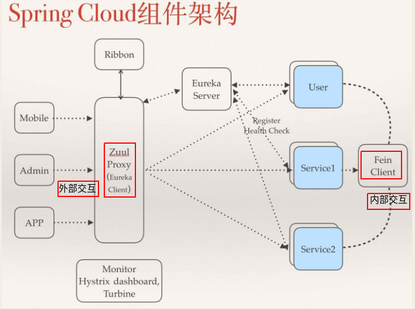
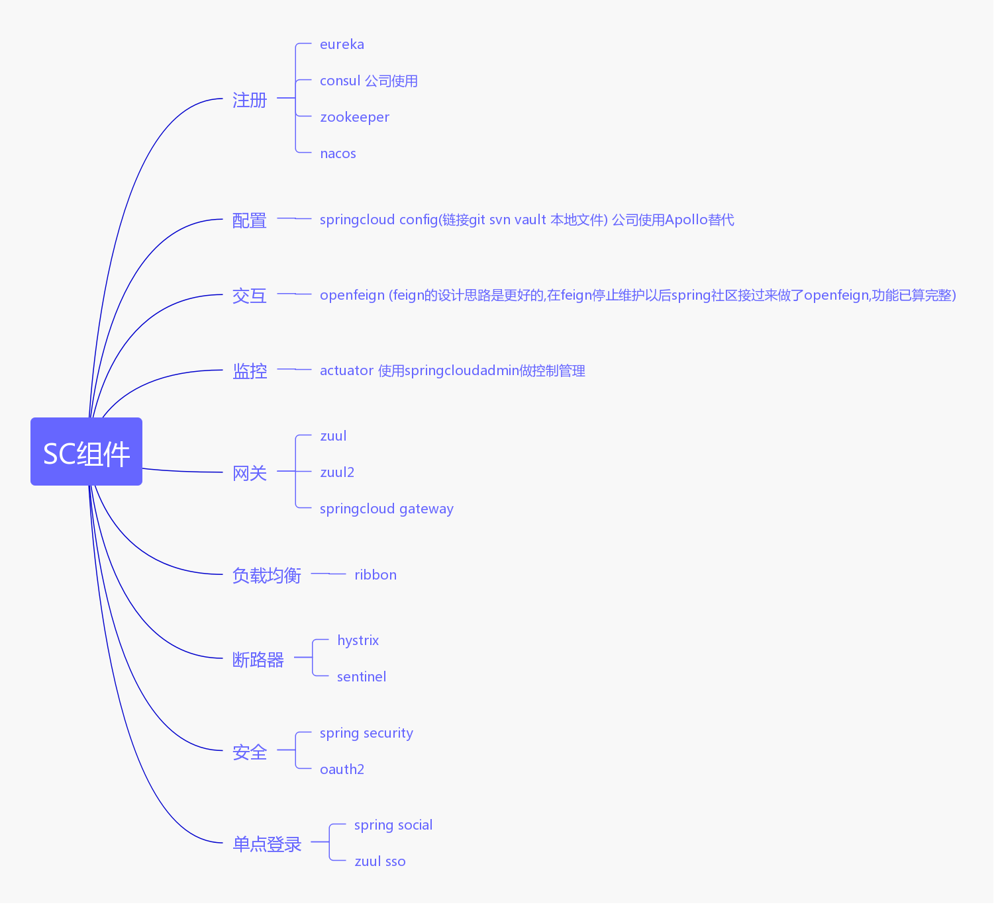

<p align="right"><b><em>last updated at {docsify-updated}</em></b></p>

## 一、springcloud组件概述

```
注册:eureka
配置:config
负载均衡:ribbon
熔断器:hystrix
网关:zuul、springcloud gateway
交互:feign
监控:actuator、turbine
追踪:zipkin、sleuth
安全:oauth2
其他支持
```

## 二、springcloud核心组件

一张比较古老的图,外部交互过zuul,内部交互使用feign



```
注册:eureka
配置:config
负载均衡:ribbon
熔断器:hystrix
网关:zuul
交互:feign
```

## 三、springcloud组件进阶选择



```
注册:consul nacos
配置:apollo nacos
负载均衡:ribbon
熔断器:sentinel
网关:springcloud gateway
交互:feign、grpc
监控:actuator、sentinel监控
追踪:zipkin、sleuth、pinpoint、skywalking
安全:oauth2

    公司注册用consul;配置用apollo;负载均衡用ribbon;hystrix是netflix套件中的依赖，保持策略为信号量模式、熔断不开启，有熔断需求统一使用
sentinel，dubbo也可以使用sentinel;网关用zuul,后续升级为springcloudgateway;交互使用openfeign,http2与grpc哪个成熟早用哪个提升调用速
度;监控使用springcloudadmin加自定义扩展;追踪使用pinpoint；安全使用oauth2与基于springsecurity的自定义安全扩展
```

## 四、spriongcloud核心思想

```
    springboot完成了容器托管、原先spring只是依托于servlet容器的一些servlet、filter、listener，现在可以将容器标准的servlet、filter、
listener托管给spring容器、spring启动时将这些组件注册到容器中去、通过spring-boot-maven-plugin完成了对jar包 war包打包方式的自由管理，
从始至终，spring都是在做一个更好的容器，用完善的生命周期、启动顺序、状态管理、事件发布、更快更优秀的容器标准，吸引开发者把自己的组件添加
spring的相应扩展。
    springcloud更进一步，做好了分布式集群中的流程与功能组件，每种组件都有其良好的扩展性，并有多种扩展，吸引更多的公司与开发者在分布式标准上
构建组件并开发相应的适配组件，永远可插拔、标准好于快于业界网站构建标准，并对未来发展提供了更多的可选择的余地，可以做到修改引入组件，改几个配
置，立马可以变为完全不同的另一套系统。
```

## 五、开发升级策略

```
    有则有矣，生产验证过的包优先使用
    好则好矣，功能强大比较稳定也可优先测试使用
    无则修矣，没有的功能或者易用性增强可以自研
    稳定为先，饼摊得越大越难升级，少修补多跟进，大版本升级最快半年一升
```

## 六、关于feign

* 原理

```
feign实现了使用接口类与springbweb的注解去映射http请求的模板，并可以通过spring的注解进行注入，内部依赖其他组件实现了熔断、负载均衡、重试的功能，
序列化有多种encoder与decoder，默认与springboot是相同标准，不要求客户顿与服务端实现同一个接口，客户端与服务端之间的链接就是http协议，双端序列
化相同标准即可以进行无缝通讯，下面会给出模式化的开发规范，实现默认带版本号，客户端与服务端添加删除字段均由服务端进行控制，对多版本client包进行适
配，由于极高的自由性，必须进行完善的测试，因为springcloud E版里有时候会出现一些莫名其妙的情况，F版暂时没有很深的体验，要明白其中的风险，进行完
全测试才可发布新版client-sdk

组件依赖关系:feign---hystrix---ribbon---retryer (retry的包需要自己引入才能根据重试规则去重试)
客户端可选：httpclient(默认)、okhttp
支持多种Encoders与Decoders(默认为SpringEncoder SpringDecoder) 支持spring标准、jackson、gson、xml等

功能
轻量级rest模板工具，目的是替代httpclient模式的代码，对springcloud进行了良好的支持

支持大部分springweb注解
@Headers
@RequestLine
@RequestMapping
@GetMapping
@PostMapping
@PutMapping
@DeleteMapping
@RequestParam
@PathVariable
@RequestBody

提供拦截修改支持
RequestInterceptor
spring security团队官方也提供了OAuth2FeignRequestInterceptor来进行服务鉴权的功能

```

关于feign作为接口模板的实践在进件系统中已有一些,本质是一些cdi加载替代了httpclient等复杂的开发模式。

* 配置

```
# feign配置
feign:
  httpclient:
    enabled: false
    max-connections: 200
    max-connections-per-route: 50
  okhttp:
    enabled: true
  compression:
    request: true
    response: true
  hystrix:
    enabled: false
  client:
    config:
      default:
        connectTimeout: 5000
        readTimeout: 90000
        loggerLevel: basic
# ribbon配置
ribbon:
  okhttp:
    enabled: true
  restclient:
    enabled: false
  httpclient:
    enabled: false
  ConnectTimeout: 3000
  ReadTimeout: 70000
  MaxAutoRetries: 0
  MaxAutoRetriesNextServer: 1
  OkToRetryOnAllOperations: true
  ServerListRefreshInterval: 5000
# hystrix配置
hystrix:
  threadpool:
    default:
      allowMaximumSizeToDivergeFromCoreSize: true
      coreSize: 10
      maximumSize: 50
      maxQueueSize: 1000
      queueSizeRejectionThreshold: 1000
  command:
    default:
      execution:
        timeout:
          enabled: true
        isolation:
          strategy: SEMAPHORE
          thread:
            timeoutInMilliseconds: 150000
          semaphore:
            maxConcurrentRequests: 10000
      fallback:
        enabled: true
        maxConcurrentRequests: 10000
      circuitBreaker:
        enabled: false
```

* 范式

```
@FeignClient(name = Constants.FOO_FEIGN_SERVICE)
public interface FooFeignService {
    //1.简单
    @GetMapping("/test/check")
    String testCheck();
    //1.简单
    @PostMapping("/test/check2")
    String testCheckPlus(@RequestParam("applyId") Long applyId, @RequestParam("status") String status);
    //2.灵活性
    @PostMapping("/test/checkJson")
    String testCheckJson(@RequestBody JSONObject jsonObject);
    //3.模式化
    @PostMapping("/test/showme")
    FooFeignResp showMe(@RequestBody ShowMeDto dto);
}
```

模式化代码可参考详情可参考 [sc-consul-app]() [sc-consul-service]() [sc-facade]() [模式化代码直通]()

> 注意!!!:模式化可以实现接口版本升级加版本号进行判断，服务端与业务端只连接http协议与序列化标准，没有接口跟bean的强限制，推荐使用

## 七、贴下关键代码

### 1.server:

#### BaseResp.java

```
@Data
public class BaseResp<T> {
    /**描述*/
    private String msg;
    /**编码*/
    private String code;
    /**数据内容*/
    private T data;

    /**
     * <p>description : 默认成功(不返回数据)</p>
     */
    public static BaseResp success() {
        return BaseResp.discuss(BaseCode.SUCCESS, null);
    }

    /**
     * <p>description : 成功(返回数据)</p>
     */
    public static <T> BaseResp<T> success(T data) {
        return BaseResp.discuss(BaseCode.SUCCESS, data);
    }

    /**
     * <p>description : 默认失败(不返回数据)</p>
     */
    public static BaseResp fail() {
        return BaseResp.discuss(BaseCode.FAIL, null);
    }

    /**
     * <p>description : 失败(返回数据)</p>
     */
    public static <T> BaseResp<T> fail(T data) {
        return BaseResp.discuss(BaseCode.FAIL, data);
    }

    /**
     * <p>description : 提示校验异常</p>
     */
    public static BaseResp review() {
        return BaseResp.discuss(BaseCode.REVIEW, null);
    }

    /**
     * <p>description : 提示校验异常(返回信息)</p>
     */
    public static BaseResp review(String msg) {
        return BaseResp.custom(BaseCode.REVIEW.getCode(), BaseCode.REVIEW.getMsg() + ":" + msg, null);
    }

    /**
     * <p>description : 提示校验异常(返回数据)</p>
     */
    public static <T> BaseResp<T> review(T data) {
        return BaseResp.discuss(BaseCode.REVIEW, data);
    }

    /**
     * <p>description : 错误</p>
     */
    public static BaseResp error() {
        return BaseResp.discuss(BaseCode.ERROR, null);
    }

    /**
     * <p>description : 自定义返回码与数据(需要在BaseCode中建立新的枚举类)</p>
     */
    public static <T> BaseResp<T> custom(BaseCode code, T data) {
        BaseResp<T> resp = new BaseResp();
        resp.setCode(code.getCode());
        resp.setMsg(code.getMsg());
        resp.setData(data);
        return resp;
    }

    /**
     * <p>description : 自定义返回码与数据</p>
     */
    public static <T> BaseResp<T> custom(String code, String msg, T data) {
        BaseResp<T> resp = new BaseResp();
        resp.setCode(code);
        resp.setMsg(msg);
        resp.setData(data);
        return resp;
    }

    private static <T> BaseResp<T> discuss(BaseCode code, T data) {
        BaseResp<T> resp = new BaseResp();
        resp.setCode(code.getCode());
        resp.setMsg(code.getMsg());
        resp.setData(data);
        return resp;
    }
}
```

#### BaseCode.java

```
public enum BaseCode {
    /**成功*/
    SUCCESS("1000", "成功"),
    /**失败*/
    FAIL("9999", "失败"),
    /**异常*/
    ERROR("0000", "未知错误,请联系管理员"),
    /**校验异常*/
    REVIEW("0001", "校验异常");

    /**回复码*/
    private String code;
    /**回复信息*/
    private String msg;

    BaseCode(String code, String msg) {
        this.code = code;
        this.msg = msg;
    }

    /**
     * <p>description : 用回复码返回对应枚举类型</p>
     */
    public static BaseCode getBaseCodeByCode(String code) {
        for (BaseCode baseCode : BaseCode.values()) {
            if (baseCode.code.equals(code)) {
                return baseCode;
            }
        }
        return null;
    }

    public String getCode() {
        return code;
    }

    public String getMsg() {
        return msg;
    }
}
```

#### TestController.java

```
@RestController
@RequestMapping("/test")
@Slf4j
@RefreshScope
public class TestController {

    @PostMapping("/showme")
    public BaseResp showMe(@RequestBody String dto) {
        log.debug(dto);
        return BaseResp.success();
    }
}
```

### 2.stub:

#### FooFeignResp.java

```
@Data
public class FooFeignResp<T> {
    /**描述*/
    private String msg;
    /**编码*/
    private String code;
    /**数据内容*/
    private T data;

    /**
     * <p>description : 默认成功(不返回数据)</p>
     */
    public static FooFeignResp success() {
        return FooFeignResp.discuss(FooFeignCode.SUCCESS, null);
    }

    /**
     * <p>description : 成功(返回数据)</p>
     */
    public static <T> FooFeignResp<T> success(T data) {
        return FooFeignResp.discuss(FooFeignCode.SUCCESS, data);
    }

    /**
     * <p>description : 默认失败(不返回数据)</p>
     */
    public static FooFeignResp fail() {
        return FooFeignResp.discuss(FooFeignCode.FAIL, null);
    }

    /**
     * <p>description : 失败(返回数据)</p>
     */
    public static <T> FooFeignResp<T> fail(T data) {
        return FooFeignResp.discuss(FooFeignCode.FAIL, data);
    }

    /**
     * <p>description : 提示校验异常</p>
     */
    public static FooFeignResp review() {
        return FooFeignResp.discuss(FooFeignCode.REVIEW, null);
    }

    /**
     * <p>description : 提示校验异常(返回信息)</p>
     */
    public static FooFeignResp review(String msg) {
        return FooFeignResp.custom(FooFeignCode.REVIEW.getCode(), FooFeignCode.REVIEW.getMsg() + ":" + msg, null);
    }

    /**
     * <p>description : 提示校验异常(返回数据)</p>
     */
    public static <T> FooFeignResp<T> review(T data) {
        return FooFeignResp.discuss(FooFeignCode.REVIEW, data);
    }

    /**
     * <p>description : 错误</p>
     */
    public static FooFeignResp error() {
        return FooFeignResp.discuss(FooFeignCode.ERROR, null);
    }

    /**
     * <p>description : 自定义返回码与数据(需要在BaseCode中建立新的枚举类)</p>
     */
    public static <T> FooFeignResp<T> custom(FooFeignCode code, T data) {
        FooFeignResp<T> resp = new FooFeignResp();
        resp.setCode(code.getCode());
        resp.setMsg(code.getMsg());
        resp.setData(data);
        return resp;
    }

    /**
     * <p>description : 自定义返回码与数据</p>
     */
    public static <T> FooFeignResp<T> custom(String code, String msg, T data) {
        FooFeignResp<T> resp = new FooFeignResp();
        resp.setCode(code);
        resp.setMsg(msg);
        resp.setData(data);
        return resp;
    }

    private static <T> FooFeignResp<T> discuss(FooFeignCode code, T data) {
        FooFeignResp<T> resp = new FooFeignResp();
        resp.setCode(code.getCode());
        resp.setMsg(code.getMsg());
        resp.setData(data);
        return resp;
    }
}
```

#### FooFeignCode.java

```
public enum FooFeignCode {
    /**成功*/
    SUCCESS("1000", "成功"),
    /**失败*/
    FAIL("9999", "失败"),
    /**异常*/
    ERROR("0000", "未知错误,请联系管理员"),
    /**校验异常*/
    REVIEW("0001", "校验异常");

    /**回复码*/
    private String code;
    /**回复信息*/
    private String msg;

    FooFeignCode(String code, String msg) {
        this.code = code;
        this.msg = msg;
    }

    /**
     * <p>description : 用回复码返回对应枚举类型</p>
     */
    public static FooFeignCode getBaseCodeByCode(String code) {
        for (FooFeignCode baseCode : FooFeignCode.values()) {
            if (baseCode.code.equals(code)) {
                return baseCode;
            }
        }
        return null;
    }

    public String getCode() {
        return code;
    }

    public String getMsg() {
        return msg;
    }
}
```

#### FooFeignStubVer.java

```
public interface FooFeignStubVer {
    String API_VERSION = "v1.0.0";

    /**
     * <p>description : </p>
     * <p>create   on : 2018-12-26 13:47:57</p>
     *
     * @author jerryniu
     * @return String 123
     * @since 1.0.0
     */
    default String getVer() {
        return API_VERSION;
    }
}
```

#### ShowMeDto.java

```
@Data
public class ShowMeDto implements FooFeignStubVer {
    private long id;
    private String name;
    private InnerDto inner;
}
```

#### InnerDto.java

```
@Data
public class InnerDto {
    private int what;
}
```

#### ConsulServiceFeignService.java

```
@FeignClient(name = Constants.CONSUL_SERVICE_FEIGN_SERVICE)
public interface ConsulServiceFeignService {

    /**
     * <p>description : </p>
     * <p>create   on : 2018-12-26 13:46:19</p>
     *
     * @author jerryniu
     * @since 1.0.0
     *
     * @param dto 示例参数
     * @return java.lang.String 示例报文
     */
    @PostMapping("/test/showme")
    FooFeignResp showMe(@RequestBody ShowMeDto dto);
}
```

### 3.client:

#### TestController.java

```
@RestController
@RequestMapping("/test")
@Slf4j
@RefreshScope
public class TestController {

    @RequestMapping("showme")
    public String showme() {
        ShowMeDto showMeDto = new ShowMeDto();
        log.debug(showMeDto.getVer());
        InnerDto inner = new InnerDto();
        inner.setWhat(2);
        showMeDto.setInner(inner);
        FooFeignResp resp = consulServiceFeignService.showMe(showMeDto);
        return resp.getCode();
    }
}
```

```
上述调用过程中,
由consulServiceFeignService#showMe(ShowMeDto dto(String ver, long id, String name. InnerDto inner))
转化为http中的body json格式 {"id":0,"name":null,"inner":{"what":2},"ver":"v1.0.0"}，
再以json格式转化到服务端TestController#showMe(String dto)，
并用String dto接收到了json，可以解析json获取api版本号ver，
在返回过程中同样讲BaseResp转化为了FooFeignResp。

开发过程中推荐使用 领域名称 + Feign + bean类别 去进行stub的开发，防止客户端使用中重名情况太多，造成混乱 例如 ApplyFeignResp、AssetFeignService、
StrategyFeignCode等

```

#### 复杂的几个例子

## 八、开发接入

### 1.比较重要的几个点

```
1.feign已经由spring团队接管,更名为 open-feign ,springcloud中有关netflix的项目统一修改为 spring-cloud-starter-netflix-* 的格式
2.feign包装了hystrix、ribbon、httpclient、retry的桥接代码，所有跟这3个有关的配置都会影响feign的表现
3.feign的配置项已经在上面的配置项里展示了大部分,consul的bootconfig中已经添加了hystrix与ribbon的默认配置,配置项管道开得比较大，如果有服
务性能耗尽或者需要熔断配置的情况下可以自行更改，绝大多数情况是不用关心的，如果你没有加载bootconfig想要完全由自己掌控，可以使用上面的配置，
feign前缀的配置需要自己添加管理，max-connections、max-connections-per-route填写的是默认配置，需要修改的可以自行控制
4.编码器解码器请使用默认的，不要自行更改，避免自动编码解码出问题的情况
5.httpclient推荐用okhttp替换apachehttpclient，原因是性能更高连接更快，需要额外引入okhttp的依赖，下面的步骤也会以这个为标准
6.由于客户端与服务端不像dubbo一样需要实现同一个接口，中间传输转换需要确认没有问题，推荐使用上面讲到的模式化开发范式，可以降低出错率
7.stub是客户端存根，类似与核心项目中的facade概念，包含了所有客户端需要用到的接口、dto、工具类、严禁依赖其他业务包、少依赖工具包或者使用向
后兼容比较优秀的工具包、尽量自成一体，减少jar包冲突
8.关于fallback，目前可不写fallback，如果想要对异常进行处理再配置FallbackFactory，处理完以后再丢出一个运行时异常，不得吞掉异常，以免出现
一些比较难解决的问题
9.一般情况下，每个服务既是客户端又是服务端，下面的步骤需要全部走一遍，禁止调用自己项目的feignclient，以免造成网络消耗

此步骤版本情况为:
springframework:5.0.11.RELEASE
springboot:2.0.7.RELEASE
springcloud:Finchley.SR2
```

### 2.开发服务端接口(类似 sc-consul-service)

```
本质就是一个基于http协议的web项目，按照开发接口的方式开发就好，值得注意的是，关键接口的url-mapping前缀应该一样(例如/resource/**)，方便
进行接口权限管理，另外要有模式化开发的 返回对象与返回码枚举对象 参考 BaseResp.java、BaseCode.java
```

### 3.写客户端存根包(类似 sc-facade)

```
1.引入依赖
<!--spring web 注解-->
<dependency>
    <groupId>org.springframework</groupId>
    <artifactId>spring-web</artifactId>
</dependency>
<!--openfeign-->
<dependency>
    <groupId>org.springframework.cloud</groupId>
    <artifactId>spring-cloud-openfeign-core</artifactId>
</dependency>
<!--简化代码-->
<dependency>
    <groupId>org.projectlombok</groupId>
    <artifactId>lombok</artifactId>
    <scope>provided</scope>
</dependency>

2.添加版本信息接口,参考 FooFeignStubVer.java

3.添加返回对象与返回码枚举对象，要与自己服务端的码相同，有的code可以不给出，但是给出的一定要一致，参考 FooFeignResp.java、FooFeignCode.java

4.添加feignclient接口,参考 ConsulServiceFeignService.java，其中的feignclient的名称为服务注册的名称
```

### 4.客户端引用(类似 sc-consul-app)

```
1.引入依赖
<!--openfeign starter-->
<dependency>
    <groupId>org.springframework.cloud</groupId>
    <artifactId>spring-cloud-starter-openfeign</artifactId>
</dependency>
<!--用ribbon替换默认的Retryer.Default-->
<dependency>
    <groupId>org.springframework.cloud</groupId>
    <artifactId>spring-cloud-starter-netflix-ribbon</artifactId>
</dependency>
<!--ribbon需要spring retry去实现重试-->
<dependency>
    <groupId>org.springframework.retry</groupId>
    <artifactId>spring-retry</artifactId>
</dependency>
<!--okhttp-->
<dependency>
    <groupId>io.github.openfeign</groupId>
    <artifactId>feign-okhttp</artifactId>
</dependency>
<!--stub(替换为你要使用的客户端存根包)-->
<dependency>
    <groupId>com.geercode.creed</groupId>
    <artifactId>sc-facade</artifactId>
</dependency>

2.添加配置

# feign配置
feign:
  httpclient:
    enabled: false
    max-connections: 200
    max-connections-per-route: 50
  okhttp:
    enabled: true
  compression:
    request: true
    response: true
  hystrix:
    enabled: false
  client:
    config:
      default:
        connectTimeout: 5000
        readTimeout: 90000
        loggerLevel: basic
        
# 如果要使用httpclient就可以删除掉okhttp的依赖，并把feign.httpclient.enabled改为true, feign.okhttp.enabled改为false
# 如果连接数满足不了要求，可以修改feign.httpclient.max-connections与feign.httpclient.max-connections-per-route的数值

3.启动类上添加 @EnableFeignClients，修改注解参数basePackages，确定扫描到 stub 包,如@EnableFeignClients(basePackages = {"com.geercode.creed.facade"})

4.使用@Autowired注入stub中的feignService进行调用

```

### 5.Q&A

```
1.如何对 feign clients 进行拦截？
实现feign.RequestInterceptor的apply方法，并用@Bean注入容器中
2.stub由谁开发？
谁提供服务谁开发，比如你要调用strategy的接口，可以向strategy的团队要stub包进行开发

```